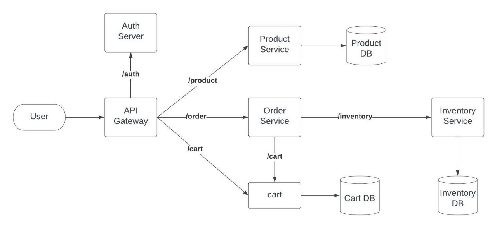

## Architecture


## ------------- API GATEWAY --------------
PORT: 8080

## ------------- AUTH SERVER --------------
PORT: 9000

```bash
LOGIN ROUTE: http://localhost:9000/api/v1/auth/users/login
REGISTER ROUTE: http://localhost:9000/api/v1/auth/users/register
VALIDATE ROUTE: http://localhost:9000/api/v1/auth/users/validate

PROFILE: http://localhost:9000/api/v1/auth/users/profile
EDIT-PROFILE: http://localhost:9000/api/v1/auth/users/profile/edit
```
## ------------- PRODUCT SERVICE ----------
PORT: 8100

```bash
GET ALL: http://localhost:8100/api/v1/products
GET ONE: http://localhost:8100/ap1/v1/products/{skuCode}

CREATE: http://localhost:8100/api/v1/products
```

## ------------- INVENTORY SERVICE --------
PORT: 8200

```bash
ADD ITEM: http://localhost:8200/api/v1/inventory/add
UPDATE ITEM: http://localhost:8200/api/v1/inventory/update

CHECK: http://localhost:8200/api/v1/inventory/check
```

## ------------- ORDER SERVICE ------------
PORT: 8300

```bash
PLACE ORDER: http://localhost:8300/api/v1/orders
GET CART ITEMS: http://localhost:8300/api/v1/orders/get
REMOVE CART ITEMS: http://localhost:8300/api/v1/orders/{orderId}/item/remove/{cartID}
```